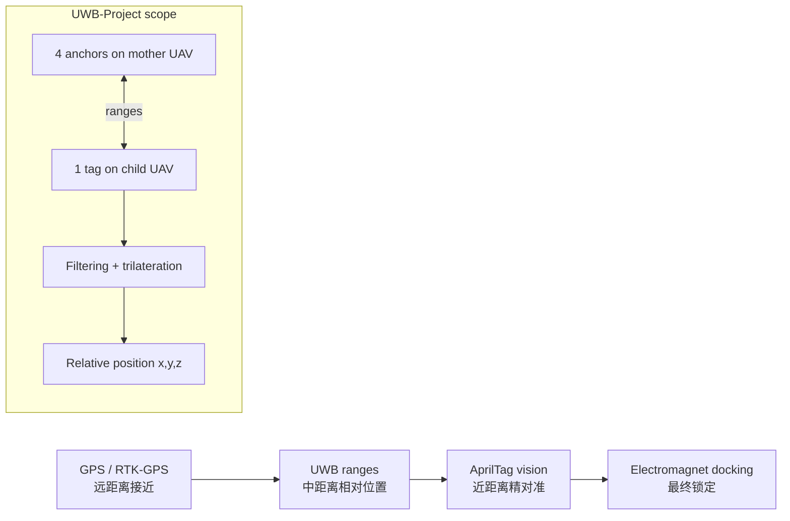

# UWB-Project

[Ha22yX/Mother-Ship-Docking-Drone-System](https://github.com/Ha22yX/Mother-Ship-Docking-Drone-System) 的 UWB 相对定位与飞控集成附属仓库。

This repository is the UWB positioning and embedded-integration workspace for the Mother-Ship Docking Drone System. It focuses on UWB ranging, anchor/tag geometry, relative-position solving, visualization, ESP-NOW mother-child communication, and Pixhawk/PX4 MAVLink experiments.

- 主项目仓库：[Mother-Ship-Docking-Drone-System](https://github.com/Ha22yX/Mother-Ship-Docking-Drone-System)
- 项目介绍网站：[https://isef.rosebeg.com](https://isef.rosebeg.com)
- 当前 UWB 仓库：[Ha22yX/UWB-Project](https://github.com/Ha22yX/UWB-Project)

> Status: experimental. This repository is a hardware/firmware test workspace, not a packaged library or ready-to-fly product.

## 仓库定位

主项目的核心问题是：子无人机如何在母无人机也处于飞行状态时，获得稳定、连续、足够精确的相对位置，并最终完成空中对接。

UWB-Project 负责其中的中距离相对定位层：

- 让母机平台上的 4 个 UWB anchor 构成局部坐标系。
- 让子机上的 UWB tag 测量到各 anchor 的距离。
- 根据 anchor 几何和测距结果求解 tag 的 `x, y, z`。
- 将 UWB 相对位置用于可视化、PX4/Pixhawk 控制实验和后续 EKF 融合。
- 同时保存母机/子机 ESP32-S3 固件、ESP-NOW 通信、MAVLink 遥测和 OpenMV/AprilTag 视觉实验。

两个仓库的关系：

| 仓库 | 主要职责 | 典型内容 |
| --- | --- | --- |
| [Mother-Ship-Docking-Drone-System](https://github.com/Ha22yX/Mother-Ship-Docking-Drone-System) | 主项目说明、系统级架构、GPS/PX4/UDP 通信实验 | GPS 漂移记录、MAVLink 转发、MAVSDK 连接、整体对接流程 |
| [UWB-Project](https://github.com/Ha22yX/UWB-Project) | UWB 相对定位和嵌入式集成 | UWB anchor/tag 固件、三边定位、ESP-NOW 母子机通信、Pixhawk 控制、OpenMV 可视化 |

## 相对位置获取方案

UWB 在整个空中对接流程中承担“中距离相对定位”的角色。GPS 把子机带到母机附近，UWB 接管后给出母机平台坐标系中的三维相对位置，视觉系统再负责最后的精对准。



### UWB 硬件拓扑

当前测试拓扑为：

- 母机端：4 个 UWB anchor，固定在对接平台上。
- 子机端：1 个 UWB tag，安装在子无人机上。
- 控制器：ESP32-S3 通过 UART 与 UWB 模块通信。
- 飞控连接：ESP32-S3 通过 TELEM 串口与 Pixhawk/PX4 交换 MAVLink。

UWB 模块输出 tag 到各 anchor 的距离，例如：

```text
an0:0.57m
an1:0.63m
an2:0.74m
an3:0.59m
```

### Anchor 坐标系

多个 sketch 当前采用同一套基础几何：

- 平台为正方形。
- 边长：35.5 inch，约 0.9017 m。
- 坐标原点：正方形中心，也就是理想对接中心。
- `x` 轴：平台左右方向。
- `y` 轴：平台前后方向。
- `z` 轴：垂直于 anchor 平面，取平台上方为正。

Anchor ID 与坐标映射：

| UWB ID | 物理位置 | 坐标 |
| --- | --- | --- |
| `an0` | 右侧边中点 | `(+HALF, 0, 0)` |
| `an1` | 下侧边中点 | `(0, -HALF, 0)` |
| `an2` | 左侧边中点 | `(-HALF, 0, 0)` |
| `an3` | 上侧边中点 | `(0, +HALF, 0)` |

这套坐标系的意义是：UWB 直接输出子机相对于母机对接平台中心的偏移，而不是输出世界坐标。这样母机移动时，子机仍然可以围绕母机进行相对控制。

### 滤波与三边定位

UWB 距离会受到天线方向、遮挡、多径和串口输出跳变影响。因此当前固件在求解前先做简单滤波：

- 每个 anchor 独立维护历史距离。
- 使用中值滤波削弱偶发离群值。
- 只有 4 个 anchor 都有有效距离时才计算位置。

二维求解使用 anchor 0 作为参考，将测距方程线性化：

```text
2(xi - x0)x + 2(yi - y0)y =
(xi^2 + yi^2 - di^2) - (x0^2 + y0^2 - d0^2)
```

对 `i = 1..3` 建立线性方程组后，用最小二乘求解 `x, y`。随后对每个 anchor 计算：

```text
z_i^2 = d_i^2 - (x - x_i)^2 - (y - y_i)^2
```

取有效 `z_i` 的平均值作为 `z`。由于单平面 anchor 会产生上下镜像解，当前实验选择正的 `z`，也就是 tag 位于母机 anchor 平面上方。

输出格式示例：

```text
[D] an0=0.570 m
[POS] x=0.031 m, y=-0.042 m, z=0.615 m
```

### 从 UWB 位置到飞控控制

`firmware/uwb/uwb_follow_pixhawk` 演示了将 UWB 位置转化为 PX4 控制量的思路：

- UWB solver 得到 `x, y, z`。
- 将平台坐标映射到机体系速度目标。
- 使用比例控制生成 `vx, vy, vz`。
- 限制最大速度，避免追踪过激。
- 如果 UWB 数据超过 1 秒未更新，则发送零速度作为保护。
- 通过 MAVLink `SET_POSITION_TARGET_LOCAL_NED` 发送给 Pixhawk。

当前控制映射中：

- `+x` 近似对应机体右方。
- `+y` 近似对应机体前方。
- `z` 表示 tag 到 anchor 平面的高度。

实际飞行前必须根据安装方向、机体系定义、PX4 frame 和母机平台方向重新校准坐标映射。

## 仓库结构

```text
firmware/
  docking/
    UAVDocking_Mother_ESPNOW/   母机 ESP32-S3 主固件：Web UI、MAVLink、ESP-NOW
    UAVDocking_Child_ESPNOW/    子机 ESP32-S3 主固件：命令接收、磁铁、PX4 setpoint
  uwb/
    uwb_anchors_esp32_1/        母机端多 UWB anchor 配置实验
    uwb_tag_esp32_2/            tag 端 4-anchor 位置求解实验
    uwb_tag_solver/             可调 interval / AT 命令的 tag 求解器
    uwb_tag_module_pos/         读取模块内置位置输出
    uwb_follow_pixhawk/         UWB 位置 -> Pixhawk 速度控制实验
    uwb_single_test/            单模块串口/AT 测试
    uwb3_test/                  多模块基础测试
    uwb_two_nodes/              两节点 UWB 测距测试
    uwb_esp32s3_uart_test/      ESP32-S3 UART 连线测试
  pixhawk/
    pixhawk_telem1_sniffer/     TELEM1 MAVLink 嗅探和解码
    pixhawk_telem1_control_test/Pixhawk 控制指令测试
    pixhawk_telem1_mavlink_parser/
  openmv/
    openmv_uart_test/           OpenMV 串口测试
    openmv_apriltag_web/        AprilTag 位姿 Web 可视化

tools/
  visualization/
    uwb_viewer.py               UWB 相对位置 3D 查看器
    uwb_tag_viewer.py           anchor/tag 距离和位置查看器
    world_camera.py             OpenMV AprilTag 位姿查看器
  debug/
    sik_debug.py                SiK / MAVLink 串口调试

docs/
  hardware/
    uwb_wiring.md               UWB 模块接线说明
    UWB_PIN_FIX.md              ESP32-S3 UWB 引脚问题与修复说明
  reference/
    px4_mavlink_docs.md         PX4/MAVLink 参考笔记

vendor/
  datasheets/                   M5Stack UWB / BU01DB 资料与 AT 命令文档

archive/
  old-main/                     旧版 Wi-Fi/HTTP 母子机实现
  prototypes/                   一次性原型 sketch
```

## 主要固件说明

### `firmware/docking/UAVDocking_Mother_ESPNOW`

母机端 ESP32-S3 固件，主要职责：

- 通过 TELEM 串口读取 PX4/Pixhawk MAVLink 遥测。
- 建立 Wi-Fi AP 和 Web 控制界面。
- 通过 ESP-NOW 与子机交换遥测与命令。
- 下发子机 arm、takeoff、land、电磁铁切换、follow on/off 等命令。
- 根据母机 GPS/航向和设定 offset 生成子机跟随目标。

Web 界面提供：

- 母机和子机遥测显示。
- 子机电磁铁状态显示。
- 子机跟随高度和前后/左右偏移微调。
- 母机/子机基本控制按钮。

### `firmware/docking/UAVDocking_Child_ESPNOW`

子机端 ESP32-S3 固件，主要职责：

- 读取本机 PX4/Pixhawk MAVLink 遥测。
- 通过 ESP-NOW 接收母机命令。
- 控制电磁铁 GPIO。
- 根据母机发送的全局 setpoint 调用 PX4 位置控制。
- 在 follow 模式下周期性向 PX4 发送 `SET_POSITION_TARGET_GLOBAL_INT`。

### `firmware/uwb/uwb_tag_solver`

用于 UWB 相对位置求解的主要测试 sketch：

- 配置 UWB 模块为 tag 模式。
- 读取 `an0:...m` 格式的距离。
- 维护 anchor 几何和距离数组。
- 求解 tag 的 `x, y, z`。
- 支持通过 USB 串口发送 `interval <n>` 或原始 AT 命令。

### `firmware/uwb/uwb_follow_pixhawk`

用于验证“UWB 相对位置 -> Pixhawk 控制”的实验 sketch：

- UWB tag 读取距离并求解位置。
- ESP32-S3 通过 TELEM 与 Pixhawk 通信。
- USB 命令可启动/停止 follow、调整 `kp`、`kz`、`vmax` 和目标高度。
- 按 10 Hz 发送速度目标，数据过期时自动停住。

### `firmware/openmv/openmv_apriltag_web`

用于视觉末端定位验证：

- ESP32-S3 通过 UART 接收 OpenMV 输出的 AprilTag 位姿。
- Web 页面展示相机/Tag 相对位置和姿态。
- 用于调试最终对接阶段的视觉方向、尺度和稳定性。

## Python 工具

安装依赖：

```bash
pip install -r tools/requirements.txt
```

常用工具：

- `tools/visualization/uwb_viewer.py`：读取串口输出，显示 UWB 求解得到的相对位置历史。
- `tools/visualization/uwb_tag_viewer.py`：显示 anchor/tag 距离和 tag 位置。
- `tools/visualization/world_camera.py`：显示 OpenMV/AprilTag 输出的相机位姿。
- `tools/debug/sik_debug.py`：调试 SiK 数传、串口和 MAVLink heartbeat。

运行前根据本机环境修改脚本顶部的 `PORT` 和 `BAUD`。

## 硬件连接

### UWB UART 基本规则

| UWB 模块引脚 | 含义 | 连接到 ESP32-S3 |
| --- | --- | --- |
| VCC | 电源，建议 3V3 | 3V3 |
| GND | 地 | GND |
| UWB_RX | 模块接收 | ESP32-S3 TX |
| UWB_TX | 模块发送 | ESP32-S3 RX |

多个 sketch 中使用的基础接线：

```text
UWB1: ESP32-S3 GPIO4  -> UWB RX, GPIO5  <- UWB TX
UWB2: ESP32-S3 GPIO15 -> UWB RX, GPIO16 <- UWB TX
UWB3: ESP32-S3 GPIO21 -> UWB RX, GPIO47 <- UWB TX
UWB4: ESP32-S3 GPIO48 -> UWB RX, GPIO40 <- UWB TX
```

注意：`docs/hardware/UWB_PIN_FIX.md` 记录了 ESP32-S3 GPIO15/GPIO16 strapping 引脚可能带来的启动和 UART 问题，并建议将部分测试中的 UWB2 TX 从 GPIO15 调整到 GPIO17。实际接线应以当前使用的 sketch 和硬件修复文档为准。

### Pixhawk TELEM 连接

常见测试接线：

```text
Pixhawk TELEM TX -> ESP32-S3 RX GPIO10
Pixhawk TELEM RX -> ESP32-S3 TX GPIO11
GND              -> GND
```

TELEM 波特率需要与代码中的 `FC_BAUD` 和 PX4 参数一致。

## 开发环境

Arduino / ESP32-S3：

- Arduino IDE 或兼容 ESP32-S3 的构建环境。
- Espressif ESP32 board support。
- MAVLink Arduino headers / library，用于 Pixhawk 相关 sketch。
- EspSoftwareSerial，用于需要额外软件串口的 sketch。

Python：

- Python 3。
- `pyserial`、`matplotlib`、`pyqtgraph` 等依赖，见 `tools/requirements.txt`。

打开 Arduino sketch 时，请从 sketch 所在文件夹打开，例如：

```text
firmware/uwb/uwb_tag_solver/uwb_tag_solver.ino
firmware/docking/UAVDocking_Mother_ESPNOW/UAVDocking_Mother_ESPNOW.ino
firmware/docking/UAVDocking_Child_ESPNOW/UAVDocking_Child_ESPNOW.ino
```

## 建议测试流程

1. **串口和供电检查**  
   先使用 `uwb_single_test` 或 `uwb_esp32s3_uart_test` 验证每个 UWB 模块能响应 AT 命令。

2. **Anchor ID 配置**  
   使用 `uwb_anchors_esp32_1` 将母机端 UWB 模块配置为固定 anchor ID，确认 `an0..an3` 与物理位置一致。

3. **Tag 测距验证**  
   使用 `uwb_tag_solver` 或 `uwb_tag_esp32_2` 读取 4 个距离，检查是否稳定、是否存在明显跳变或 ID 对错。

4. **几何校准**  
   确认平台边长、anchor 实际位置、坐标轴方向和代码中的 `AX/AY` 常量一致。

5. **位置可视化**  
   使用 `tools/visualization/uwb_viewer.py` 或 `uwb_tag_viewer.py` 查看 `x, y, z` 是否符合实际移动方向。

6. **Pixhawk 架台集成**  
   使用 `uwb_follow_pixhawk` 在无桨状态下验证 MAVLink heartbeat、setpoint 发送和 failsafe 行为。

7. **母子机通信集成**  
   使用 `UAVDocking_Mother_ESPNOW` 和 `UAVDocking_Child_ESPNOW` 验证 ESP-NOW 遥测、命令、电磁铁和 Web UI。

8. **低风险飞行测试**  
   在开阔低风环境中逐步测试，先低速、低高度、有人接管，再进入对接实验。

## 当前限制与后续方向

当前仓库更偏向实验集成，仍需要根据实机硬件继续校准：

- UWB anchor 的实际安装误差会直接影响求解精度。
- 单平面 anchor 对 `z` 存在镜像和几何条件限制。
- UWB 容易受到遮挡、多径和天线方向影响，需要做残差检测和质量评估。
- 当前简单中值滤波适合早期测试，后续应接入主项目 EKF。
- UWB 坐标到 PX4 机体系或 NED frame 的映射必须在实机上验证。
- 视觉 AprilTag 与 UWB 坐标系之间需要外参标定。

后续融合方向：

- 将 UWB `x, y, z` 作为 EKF 的中距离位置观测。
- 将 AprilTag `tx, ty, tz, rx, ry, rz` 作为末端位姿观测。
- 根据 UWB 残差、AprilTag 可见性、GPS fix type 和数据 age 动态调整协方差。
- 在传感器失效时自动降速、悬停或退出对接流程。

## 安全说明

UWB 测试本身风险较低，但本仓库包含 Pixhawk 控制、电磁铁和真实无人机对接相关代码。请遵守：

- 架台调试时拆除桨叶。
- 不要在未验证坐标映射时启用自动跟随。
- 先用串口日志和可视化确认方向，再连接飞控控制链路。
- 使用 PX4 failsafe、RC kill switch 和人工接管。
- 电磁铁和锂电池测试需要独立检查供电、电流和散热。

## 推荐 GitHub 仓库简介

可用于 GitHub About 的短描述：

```text
UWB ranging, trilateration, ESP32-S3 firmware, visualization, and Pixhawk/MAVLink integration for an autonomous mother-ship UAV docking system.
```

推荐 topics：

```text
uwb, esp32, px4, mavlink, uav, trilateration, localization, sensor-fusion, apriltag, robotics
```

## License

No license file is currently included. Add a license before reusing or distributing the project as an open-source package.
