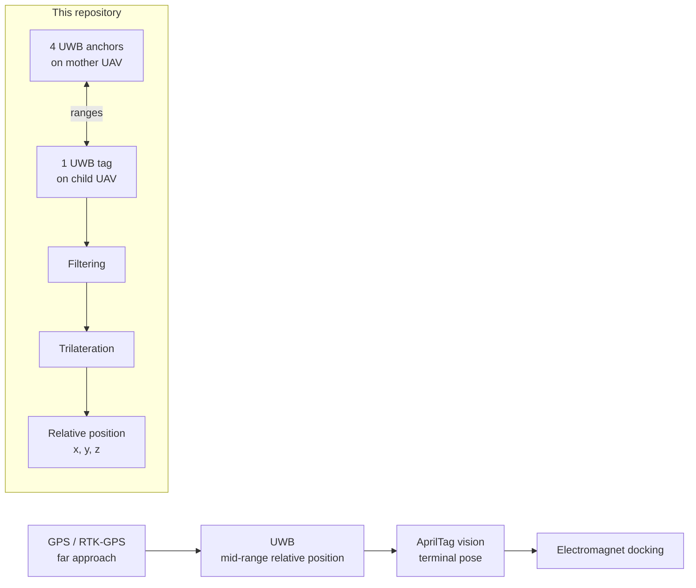

# UWB-Project

[Chinese](README.zh-CN.md) | [Main Project](https://github.com/Ha22yX/Mother-Ship-Docking-Drone-System) | [Project Website](https://isef.rosebeg.com)

UWB ranging, trilateration, ESP32-S3 firmware, visualization, and Pixhawk/MAVLink integration for the **Mother-Ship Docking Drone System**.

This repository is the UWB and embedded-integration companion workspace for [Ha22yX/Mother-Ship-Docking-Drone-System](https://github.com/Ha22yX/Mother-Ship-Docking-Drone-System). It focuses on the mid-range relative localization layer: estimating where the child UAV is relative to the mother UAV's docking platform.

> Status: experimental hardware/firmware workspace. The code is intended for bench testing, integration experiments, and research documentation. It is not a packaged flight-control product.

## What This Repository Provides

- ESP32-S3 Arduino sketches for UWB anchor and tag experiments.
- A 4-anchor + 1-tag UWB relative-position solver.
- Median filtering and least-squares trilateration from UWB range measurements.
- Pixhawk/PX4 MAVLink experiments for sending UWB-based follow commands.
- ESP-NOW mother/child UAV firmware for telemetry exchange and command forwarding.
- OpenMV/AprilTag UART and web-visualization experiments for terminal docking pose.
- Python visualization and serial-debugging tools.
- Wiring notes, datasheets, and archived prototypes.

## Relationship to the Main Project

| Repository | Role | Scope |
| --- | --- | --- |
| [Mother-Ship-Docking-Drone-System](https://github.com/Ha22yX/Mother-Ship-Docking-Drone-System) | Project-level repository | Overall docking architecture, GPS drift tests, PX4/MAVLink UDP routing, system explanation |
| [UWB-Project](https://github.com/Ha22yX/UWB-Project) | UWB and embedded companion repository | UWB ranging, relative localization, ESP32-S3 firmware, ESP-NOW communication, Pixhawk integration |

The main project explains the full multi-sensor docking pipeline. This repository contains the lower-level firmware and tools used to validate the UWB part of that pipeline.

## Localization Role

The full docking concept uses multiple sensing layers:



UWB is used after GPS has brought the child UAV near the mother UAV, but before AprilTag vision becomes reliable enough for final docking. The output is a local relative position in the mother-platform coordinate frame.

## UWB Positioning Method

### Hardware Topology

Current experiments use:

- Mother UAV / docking platform: 4 UWB anchors.
- Child UAV: 1 UWB tag.
- ESP32-S3: UART bridge, AT-command configuration, and position solving.
- Optional Pixhawk/PX4 link: MAVLink over TELEM for control experiments.

Example ranging output from the UWB tag:

```text
an0:0.57m
an1:0.63m
an2:0.74m
an3:0.59m
```

### Anchor Coordinate Frame

Several sketches use a square anchor layout:

- Square side length: `35.5 in` (`0.9017 m`).
- Origin: center of the docking platform.
- `x` axis: left/right across the docking frame.
- `y` axis: forward/back across the docking frame.
- `z` axis: perpendicular to the anchor plane, positive above the platform.

| UWB ID | Physical position | Coordinate |
| --- | --- | --- |
| `an0` | Right midpoint | `(+HALF, 0, 0)` |
| `an1` | Bottom midpoint | `(0, -HALF, 0)` |
| `an2` | Left midpoint | `(-HALF, 0, 0)` |
| `an3` | Top midpoint | `(0, +HALF, 0)` |

This frame is important because it directly describes the child UAV's offset from the mother UAV's docking center.

### Solver

The tag-side solver performs:

1. Parse distance lines such as `an0:0.57m`.
2. Keep a per-anchor distance buffer.
3. Apply a small median filter to reduce spikes.
4. Require all four anchor distances before solving.
5. Linearize range equations using anchor 0 as the reference.
6. Solve `x` and `y` with least squares.
7. Estimate `z` from the remaining range equation and select the positive mirror solution above the anchor plane.

The linearized 2D equation is:

```text
2(xi - x0)x + 2(yi - y0)y =
(xi^2 + yi^2 - di^2) - (x0^2 + y0^2 - d0^2)
```

The height estimate is derived from:

```text
z_i^2 = d_i^2 - (x - x_i)^2 - (y - y_i)^2
```

Typical solved output:

```text
[D] an0=0.570 m
[POS] x=0.031 m, y=-0.042 m, z=0.615 m
```

## Repository Layout

```text
firmware/
  docking/
    UAVDocking_Mother_ESPNOW/   Mother UAV ESP32-S3 firmware: Web UI, MAVLink, ESP-NOW
    UAVDocking_Child_ESPNOW/    Child UAV ESP32-S3 firmware: commands, magnet, PX4 setpoints
  uwb/
    uwb_anchors_esp32_1/        Multi-anchor UWB setup experiments
    uwb_tag_esp32_2/            4-anchor tag-side position solver
    uwb_tag_solver/             Interactive tag solver with AT command support
    uwb_tag_module_pos/         Reads the module's built-in position output
    uwb_follow_pixhawk/         UWB position to Pixhawk velocity-control experiment
    uwb_single_test/            Single-module serial/AT test
    uwb3_test/                  Multi-module basic tests
    uwb_two_nodes/              Two-node UWB ranging test
    uwb_esp32s3_uart_test/      ESP32-S3 UART wiring test
  pixhawk/
    pixhawk_telem1_sniffer/     MAVLink sniffing and decoding
    pixhawk_telem1_control_test/Pixhawk command tests
    pixhawk_telem1_mavlink_parser/
  openmv/
    openmv_uart_test/           OpenMV UART test
    openmv_apriltag_web/        AprilTag pose web viewer

tools/
  visualization/
    uwb_viewer.py               3D UWB relative-position viewer
    uwb_tag_viewer.py           Anchor/tag range and position viewer
    world_camera.py             OpenMV AprilTag camera-pose viewer
  debug/
    sik_debug.py                SiK radio and MAVLink serial debugger

docs/
  hardware/
    uwb_wiring.md               UWB wiring notes
    UWB_PIN_FIX.md              ESP32-S3 pin issue and fix notes
  reference/
    px4_mavlink_docs.md         PX4/MAVLink reference notes

vendor/
  datasheets/                   UWB module datasheets and AT-command references

archive/
  old-main/                     Older Wi-Fi/HTTP docking implementations
  prototypes/                   One-off exploratory sketches
```

## Main Firmware

| Path | Description |
| --- | --- |
| `firmware/docking/UAVDocking_Mother_ESPNOW` | Mother-side ESP32-S3 firmware. Reads Pixhawk telemetry, hosts a Web UI, exchanges telemetry/commands over ESP-NOW, and forwards child UAV commands. |
| `firmware/docking/UAVDocking_Child_ESPNOW` | Child-side ESP32-S3 firmware. Receives ESP-NOW commands, controls the electromagnet GPIO, reads local Pixhawk telemetry, and sends PX4 setpoints. |
| `firmware/uwb/uwb_tag_solver` | Main interactive UWB tag-side solver for range parsing, filtering, and `x, y, z` estimation. |
| `firmware/uwb/uwb_follow_pixhawk` | Demonstrates converting solved UWB position into Pixhawk body-frame velocity setpoints. |
| `firmware/openmv/openmv_apriltag_web` | Receives OpenMV AprilTag pose over UART and displays camera/tag pose in a browser. |

## Python Tools

Install tool dependencies:

```bash
pip install -r tools/requirements.txt
```

Useful scripts:

- `tools/visualization/uwb_viewer.py`: serial UWB position viewer with 3D plotting.
- `tools/visualization/uwb_tag_viewer.py`: anchor/tag range and position visualization.
- `tools/visualization/world_camera.py`: OpenMV AprilTag camera-pose viewer.
- `tools/debug/sik_debug.py`: serial, SiK radio, and MAVLink heartbeat debugging.

Most scripts define `PORT` and `BAUD` near the top of the file. Update them before running.

## Hardware Notes

### UWB UART Wiring

| UWB module pin | Meaning | Connect to ESP32-S3 |
| --- | --- | --- |
| VCC | Power, usually 3V3 | 3V3 |
| GND | Ground | GND |
| UWB_RX | Module receive | ESP32-S3 TX |
| UWB_TX | Module transmit | ESP32-S3 RX |

Common wiring used by several sketches:

```text
UWB1: ESP32-S3 GPIO4  -> UWB RX, GPIO5  <- UWB TX
UWB2: ESP32-S3 GPIO15 -> UWB RX, GPIO16 <- UWB TX
UWB3: ESP32-S3 GPIO21 -> UWB RX, GPIO47 <- UWB TX
UWB4: ESP32-S3 GPIO48 -> UWB RX, GPIO40 <- UWB TX
```

See `docs/hardware/UWB_PIN_FIX.md` for the ESP32-S3 GPIO15/GPIO16 strapping-pin issue and the GPIO17 fix used in some tests.

### Pixhawk TELEM Wiring

```text
Pixhawk TELEM TX -> ESP32-S3 RX GPIO10
Pixhawk TELEM RX -> ESP32-S3 TX GPIO11
GND              -> GND
```

Make sure `FC_BAUD` matches the PX4 TELEM port configuration.

## Development Environment

Arduino / ESP32-S3:

- Arduino IDE or another ESP32-S3 compatible build environment.
- Espressif ESP32 board support.
- MAVLink Arduino headers or library for Pixhawk-related sketches.
- EspSoftwareSerial for sketches that require an additional software serial port.

Python:

- Python 3.
- Dependencies from `tools/requirements.txt`.

Open sketches from their own folder so the folder name matches the `.ino` file name:

```text
firmware/uwb/uwb_tag_solver/uwb_tag_solver.ino
firmware/docking/UAVDocking_Mother_ESPNOW/UAVDocking_Mother_ESPNOW.ino
firmware/docking/UAVDocking_Child_ESPNOW/UAVDocking_Child_ESPNOW.ino
```

## Recommended Test Workflow

1. **Power and UART check**  
   Use `uwb_single_test` or `uwb_esp32s3_uart_test` to confirm that each UWB module responds to AT commands.

2. **Anchor ID configuration**  
   Use `uwb_anchors_esp32_1` to configure fixed anchor IDs. Verify that `an0..an3` match the physical layout.

3. **Tag ranging**  
   Use `uwb_tag_solver` or `uwb_tag_esp32_2` to read all four distances and check for stability.

4. **Geometry calibration**  
   Confirm platform size, anchor coordinates, and coordinate-axis directions.

5. **Visualization**  
   Use `uwb_viewer.py` or `uwb_tag_viewer.py` to verify that solved `x, y, z` matches real tag movement.

6. **Pixhawk bench integration**  
   Test `uwb_follow_pixhawk` with propellers removed. Verify MAVLink heartbeat, setpoint sending, and stale-data protection.

7. **Mother/child communication**  
   Test `UAVDocking_Mother_ESPNOW` and `UAVDocking_Child_ESPNOW` for telemetry exchange, command forwarding, magnet control, and Web UI status.

8. **Low-risk flight tests**  
   Only after bench validation, test at low altitude and low speed with manual takeover available.

## Limitations

- The current UWB solver assumes known anchor positions and a mostly planar anchor layout.
- A single anchor plane produces a vertical mirror ambiguity; current tests choose the positive `z` solution.
- Multipath, antenna orientation, body obstruction, and incorrect anchor IDs can introduce large errors.
- The current median filter is simple and intended for early experiments.
- UWB-to-PX4 frame mapping must be calibrated on the real vehicle.
- UWB and AprilTag frames still need robust extrinsic calibration for final docking.

## Safety

- Remove propellers during bench tests.
- Do not enable follow or docking control until coordinate frames are validated.
- Keep PX4 failsafes, RC override, and a kill switch available.
- Verify electromagnet power, current, heat, and wiring separately.
- Start with low speed, low altitude, and supervised tests.

## Suggested GitHub Description

```text
UWB ranging, trilateration, ESP32-S3 firmware, visualization, and Pixhawk/MAVLink integration for an autonomous mother-ship UAV docking system.
```

Suggested topics:

```text
uwb, esp32, px4, mavlink, uav, trilateration, localization, sensor-fusion, apriltag, robotics
```

## License

No license file is currently included. Add a license before reusing or distributing this project as an open-source package.
