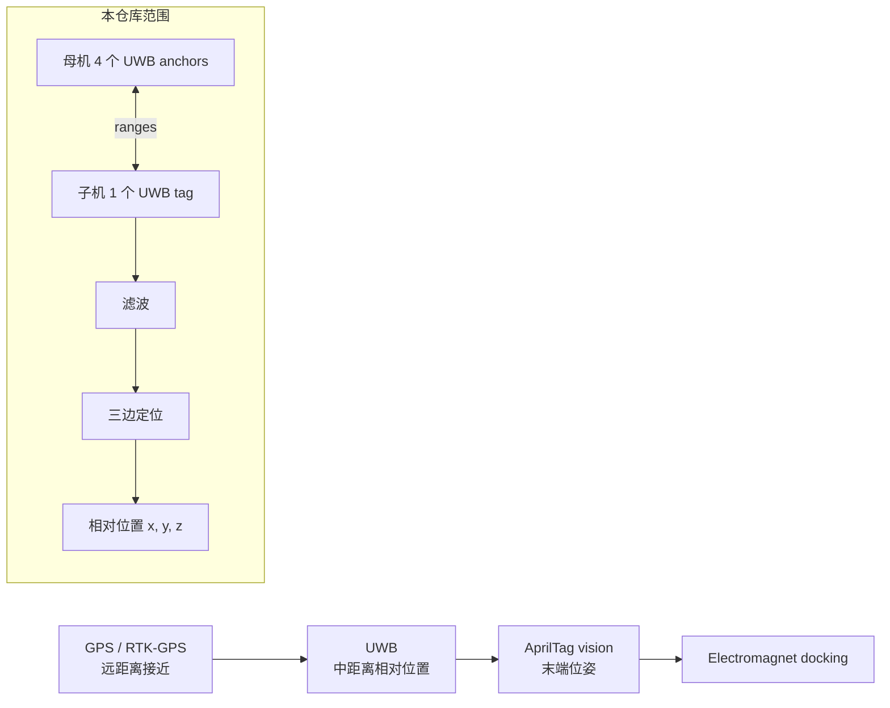

# UWB-Project

[English](README.md) | [主项目仓库](https://github.com/Ha22yX/Mother-Ship-Docking-Drone-System) | [项目网站](https://isef.rosebeg.com)

本仓库是 [Mother-Ship-Docking-Drone-System](https://github.com/Ha22yX/Mother-Ship-Docking-Drone-System) 的 UWB 和嵌入式集成附属仓库，负责中距离相对定位层：估计子无人机相对于母机对接平台的位置。

> 状态：实验性硬件/固件工作区。代码用于架台测试、集成实验和研究记录，不是可直接飞行的完整飞控产品。

## 本仓库提供什么

- ESP32-S3 / Arduino UWB anchor 和 tag 实验固件。
- 4 anchor + 1 tag 的 UWB 相对位置求解。
- UWB 距离中值滤波和最小二乘三边定位。
- 基于 UWB 位置向 Pixhawk/PX4 发送跟随控制目标的实验。
- ESP-NOW 母机/子机遥测交换和命令转发固件。
- OpenMV/AprilTag 串口和 Web 位姿可视化实验。
- Python 可视化和串口调试工具。
- 接线说明、模块资料和归档原型。

## 与主项目的关系

| 仓库 | 角色 | 范围 |
| --- | --- | --- |
| [Mother-Ship-Docking-Drone-System](https://github.com/Ha22yX/Mother-Ship-Docking-Drone-System) | 项目级仓库 | 总体对接架构、GPS 漂移、PX4/MAVLink UDP 转发、系统说明 |
| [UWB-Project](https://github.com/Ha22yX/UWB-Project) | UWB 与嵌入式附属仓库 | UWB 测距、相对定位、ESP32-S3 固件、ESP-NOW 通信、Pixhawk 集成 |

主仓库解释完整的多传感器对接方案，本仓库保存验证 UWB 层所需的底层固件和工具。

## UWB 在定位流程中的作用

完整对接流程采用多层传感器：



UWB 在 GPS 把子机带到母机附近之后接管，输出母机平台坐标系下的局部相对位置，为后续 AprilTag 末端精对准提供过渡。

## UWB 定位方法

### 硬件拓扑

当前实验使用：

- 母机/对接平台：4 个 UWB anchor。
- 子机：1 个 UWB tag。
- ESP32-S3：UART 桥接、AT 命令配置和位置求解。
- 可选 Pixhawk/PX4：通过 TELEM 串口使用 MAVLink 做控制实验。

UWB tag 典型测距输出：

```text
an0:0.57m
an1:0.63m
an2:0.74m
an3:0.59m
```

### Anchor 坐标系

多个 sketch 使用正方形 anchor 布局：

- 边长：`35.5 in`，约 `0.9017 m`。
- 原点：对接平台中心。
- `x` 轴：平台左右方向。
- `y` 轴：平台前后方向。
- `z` 轴：垂直于 anchor 平面，平台上方为正。

| UWB ID | 物理位置 | 坐标 |
| --- | --- | --- |
| `an0` | 右侧中点 | `(+HALF, 0, 0)` |
| `an1` | 下侧中点 | `(0, -HALF, 0)` |
| `an2` | 左侧中点 | `(-HALF, 0, 0)` |
| `an3` | 上侧中点 | `(0, +HALF, 0)` |

这个坐标系直接描述子机相对于母机对接中心的偏移。

### 求解器

tag 端求解器流程：

1. 解析 `an0:0.57m` 这样的距离行。
2. 为每个 anchor 维护距离缓存。
3. 使用小窗口中值滤波降低跳变。
4. 只有 4 个 anchor 都有距离时才求解。
5. 以 anchor 0 为参考线性化测距方程。
6. 最小二乘求解 `x` 和 `y`。
7. 根据测距方程估计 `z`，并选择 anchor 平面上方的正镜像解。

二维线性化方程：

```text
2(xi - x0)x + 2(yi - y0)y =
(xi^2 + yi^2 - di^2) - (x0^2 + y0^2 - d0^2)
```

高度估计：

```text
z_i^2 = d_i^2 - (x - x_i)^2 - (y - y_i)^2
```

典型输出：

```text
[D] an0=0.570 m
[POS] x=0.031 m, y=-0.042 m, z=0.615 m
```

## 仓库结构

```text
firmware/
  docking/
    UAVDocking_Mother_ESPNOW/   母机 ESP32-S3 固件：Web UI、MAVLink、ESP-NOW
    UAVDocking_Child_ESPNOW/    子机 ESP32-S3 固件：命令、磁铁、PX4 setpoints
  uwb/
    uwb_anchors_esp32_1/        多 anchor UWB 配置实验
    uwb_tag_esp32_2/            4-anchor tag 端位置求解
    uwb_tag_solver/             支持 AT 命令的交互式 tag 求解器
    uwb_tag_module_pos/         读取模块内置位置输出
    uwb_follow_pixhawk/         UWB 位置到 Pixhawk 速度控制实验
    uwb_single_test/            单模块串口/AT 测试
    uwb3_test/                  多模块基础测试
    uwb_two_nodes/              两节点 UWB 测距
    uwb_esp32s3_uart_test/      ESP32-S3 UART 接线测试
  pixhawk/                      Pixhawk TELEM1 嗅探、解析和控制测试
  openmv/                       OpenMV UART 与 AprilTag Web 实验

tools/
  visualization/                UWB 和 AprilTag 位姿可视化工具
  debug/                        SiK 电台和 MAVLink 串口调试

docs/
  hardware/                     UWB 接线和 ESP32-S3 引脚说明
  reference/                    PX4/MAVLink 参考笔记

vendor/
  datasheets/                   UWB 模块资料和 AT 命令文档

archive/                        旧版实现和原型
```

## 主要固件

| 路径 | 说明 |
| --- | --- |
| `firmware/docking/UAVDocking_Mother_ESPNOW` | 母机端 ESP32-S3 固件，读取 Pixhawk 遥测，提供 Web UI，通过 ESP-NOW 与子机交换遥测和命令。 |
| `firmware/docking/UAVDocking_Child_ESPNOW` | 子机端 ESP32-S3 固件，接收 ESP-NOW 命令，控制电磁铁，读取本机 Pixhawk 遥测并发送 PX4 setpoint。 |
| `firmware/uwb/uwb_tag_solver` | 主要交互式 UWB tag 求解器，负责测距解析、滤波和 `x, y, z` 估计。 |
| `firmware/uwb/uwb_follow_pixhawk` | 将 UWB 位置转换为 Pixhawk 机体系速度目标的实验。 |
| `firmware/openmv/openmv_apriltag_web` | 通过 UART 接收 OpenMV AprilTag 位姿，并在浏览器显示。 |

## Python 工具

安装依赖：

```bash
pip install -r tools/requirements.txt
```

常用脚本：

- `tools/visualization/uwb_viewer.py`：串口 UWB 位置 3D 查看器。
- `tools/visualization/uwb_tag_viewer.py`：anchor/tag 距离和位置可视化。
- `tools/visualization/world_camera.py`：OpenMV AprilTag 相机位姿查看器。
- `tools/debug/sik_debug.py`：串口、SiK 电台和 MAVLink heartbeat 调试。

多数脚本在文件顶部定义了 `PORT` 和 `BAUD`，运行前需要按本机串口修改。

## 硬件说明

### UWB UART 接线

| UWB 模块引脚 | 含义 | 连接到 ESP32-S3 |
| --- | --- | --- |
| VCC | 电源，通常 3V3 | 3V3 |
| GND | 地 | GND |
| UWB_RX | 模块接收 | ESP32-S3 TX |
| UWB_TX | 模块发送 | ESP32-S3 RX |

多个 sketch 使用的常见接线：

```text
UWB1: ESP32-S3 GPIO4  -> UWB RX, GPIO5  <- UWB TX
UWB2: ESP32-S3 GPIO15 -> UWB RX, GPIO16 <- UWB TX
UWB3: ESP32-S3 GPIO21 -> UWB RX, GPIO47 <- UWB TX
UWB4: ESP32-S3 GPIO48 -> UWB RX, GPIO40 <- UWB TX
```

`docs/hardware/UWB_PIN_FIX.md` 记录了 ESP32-S3 GPIO15/GPIO16 strapping 引脚问题，以及部分测试中使用 GPIO17 的修复方案。

### Pixhawk TELEM 接线

```text
Pixhawk TELEM TX -> ESP32-S3 RX GPIO10
Pixhawk TELEM RX -> ESP32-S3 TX GPIO11
GND              -> GND
```

请确保 `FC_BAUD` 与 PX4 TELEM 端口配置一致。

## 开发环境

Arduino / ESP32-S3：

- Arduino IDE 或其他支持 ESP32-S3 的构建环境。
- Espressif ESP32 board support。
- Pixhawk 相关 sketch 需要 MAVLink Arduino headers 或库。
- 需要额外软件串口的 sketch 需要 EspSoftwareSerial。

Python：

- Python 3。
- `tools/requirements.txt` 中的依赖。

从 sketch 所在文件夹打开 `.ino` 文件，确保文件夹名与 `.ino` 文件名一致。

## 推荐测试流程

1. **供电和 UART 检查**：使用 `uwb_single_test` 或 `uwb_esp32s3_uart_test` 确认模块响应 AT 命令。
2. **Anchor ID 配置**：使用 `uwb_anchors_esp32_1` 配置固定 ID，确认 `an0..an3` 与物理布局一致。
3. **Tag 测距**：使用 `uwb_tag_solver` 或 `uwb_tag_esp32_2` 读取 4 个距离并检查稳定性。
4. **几何校准**：确认平台尺寸、anchor 坐标和坐标轴方向。
5. **位置可视化**：用 `uwb_viewer.py` 或 `uwb_tag_viewer.py` 验证 `x, y, z` 与实际移动一致。
6. **Pixhawk 架台集成**：拆桨测试 `uwb_follow_pixhawk`，验证 heartbeat、setpoint 和数据过期保护。
7. **母子机通信**：测试 `UAVDocking_Mother_ESPNOW` 与 `UAVDocking_Child_ESPNOW` 的遥测、命令、电磁铁和 Web UI。
8. **低风险飞行测试**：架台验证后再低高度、低速度、有人工接管地测试。

## 当前限制

- UWB 求解依赖准确的 anchor 坐标和 ID。
- 单平面 anchor 会产生上下镜像解，当前选择正 `z`。
- 多径、天线方向、机体遮挡和错误 ID 都会造成明显误差。
- 当前中值滤波较简单，主要用于早期实验。
- UWB 到 PX4 坐标系的映射必须在实机上校准。
- UWB 与 AprilTag 坐标系仍需要更可靠的外参标定。

## 安全说明

- 架台测试时拆除桨叶。
- 坐标系未验证前不要启用自动跟随或对接控制。
- 保留 PX4 failsafe、RC override 和 kill switch。
- 单独验证电磁铁供电、电流、发热和接线。
- 早期测试保持低速、低高度，并有人监督。

## License

当前仓库暂未包含 license 文件。若需要作为开源项目复用或分发，建议补充明确 license。
