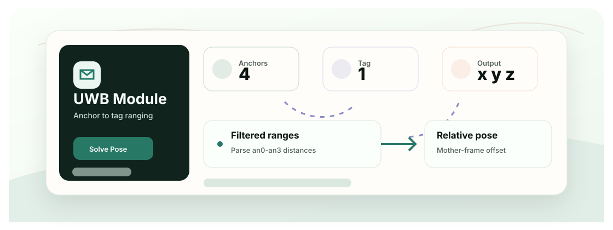

<div align="center">
  <h1>UWB Project</h1>
  <p>面向母机对接无人机系统的 UWB 测距、三边定位、ESP32-S3 固件和可视化实验仓库。</p>

  <p>
    <a href="README.md">English</a>
    &middot;
    <a href="https://github.com/Ha22yX/Mother-Ship-Docking-Drone-System">主项目</a>
    &middot;
    <a href="https://github.com/Ha22yX/OpenMV-AprilTag">视觉模块</a>
    &middot;
    <a href="https://isef.rosebeg.com">项目网站</a>
    &middot;
    <a href="#快速开始">快速开始</a>
    &middot;
    <a href="#核心能力">核心能力</a>
    &middot;
    <a href="#技术栈">技术栈</a>
  </p>

  <p>
    
    
    
    
  </p>
</div>

<p align="center">
  
</p>

## 项目概览

这个仓库负责 Mother-Ship Docking Drone System 中的中距离相对定位层。GPS/RTK 可以让子无人机接近母机平台，但真正对接时需要母机坐标系下的局部位置估计。

本仓库的重点是把 UWB 锚点到标签的距离转换成可观察的 `x, y, z` 估计，并为 Pixhawk/MAVLink 和主对接系统预留集成路径。

## 核心能力

- ESP32-S3 Arduino 草图，覆盖 UWB 测距、ESP-NOW 和 Pixhawk 通信实验。
- 面向母机对接框架的四锚点相对定位几何。
- 通过三边定位/最小二乘把距离转换成局部位置。
- Python 串口工具和 3D 可视化工具，用于检查距离和位姿流。
- 作为主对接项目的 UWB 附属模块，与 OpenMV AprilTag 视觉模块互补。

## 工作方式

1. 在母机对接框架上布置 UWB 锚点，在子无人机上布置 UWB 标签。
2. 通过 ESP32-S3/UWB 硬件链路读取各锚点距离。
3. 对距离跳变进行过滤，并映射到已配置的锚点几何。
4. 解算相对位置，并通过 PC 工具可视化。
5. 在末端视觉接管前，把结果作为中距离定位信号。

## 快速开始

克隆仓库，安装 PC 可视化依赖，然后用 Arduino IDE 或 ESP32 工具链烧录 `firmware/` 中的固件。

```bash
git clone https://github.com/Ha22yX/UWB-Project.git
cd UWB-Project
pip install -r tools/requirements.txt
# 在 Arduino IDE 中烧录 firmware/ 下的 ESP32-S3 草图
python tools/visualization/uwb_viewer.py
```

运行前请根据实际硬件修改串口、UWB ID、锚点坐标和波特率。

## 配置项

| 项目 | 需要调整的内容 |
| --- | --- |
| 锚点几何 | 测量母机对接框上的锚点位置，并保持单位一致。 |
| 串口 | 设置 ESP32-S3、UWB、Pixhawk 对应的串口。 |
| UWB ID | 让固件中的锚点/标签 ID 与物理模块一致。 |
| 飞控链路 | MAVLink/Pixhawk 脚本属于台架实验，实飞前必须单独验证。 |

## 技术栈

| 层级 | 技术 | 作用 |
| --- | --- | --- |
| 固件 | Arduino, ESP32-S3 | UWB、ESP-NOW 和 Pixhawk 实验。 |
| 定位 | UWB 三边定位 | 把距离转换成母机坐标系下的相对位置。 |
| 可视化 | pyserial, matplotlib, PyQtGraph | 检查串口数据和位姿流。 |
| 集成 | Pixhawk, MAVLink | 准备飞控通信链路。 |

## 项目结构

```text
firmware/uwb/             UWB 测距和解算草图
firmware/docking/         母机/子机 ESP-NOW 对接草图
firmware/pixhawk/         Pixhawk TELEM 与 MAVLink 实验
tools/visualization/      串口与 3D 可视化工具
docs/                     接线说明、参考资料和图示
archive/                  历史原型
```

## 项目状态

这是硬件研究工作区，适合台架测试和文档沉淀；它不是可直接实飞的飞控软件包，也不是安全认证过的对接控制器。

## 相关项目

- [Mother-Ship-Docking-Drone-System](https://github.com/Ha22yX/Mother-Ship-Docking-Drone-System) - 主无人机对接项目。
- [OpenMV-AprilTag](https://github.com/Ha22yX/OpenMV-AprilTag) - 末端视觉定位模块。

## 许可证

当前仓库尚未声明项目级开源许可证；公开复用或分发前建议先补充 License。
